# [___ShareTheNeeds___](https://sharetheneeds.herokuapp.com)

  

____

### Table Of Content

- [Description](#description)
- [Visuals](#visuals)
- [Technologies](#technologies)
- [Installation](#installation)
- [Refrences](#refrences)
- [Support](#support)
- [Author and Acknowledgment](#author_acknowledgment)

____
##  *Description :*
Our project is focusing on the current situation of covid 19. This project is platform for the people who need help and indeed people who are ready to help. 

Using ShareTheNeeds cross platform mobile based Application migrant or poor people can access to the nearby camp for the need of essential items and volunteers can help the needy once

Using ShareTheNeeds website we are giving platform to volunteers to mark their location and add their essential items in it so that we can get an idea and be able to visualize that how many volunteers are active through the map and how many people are approaching to them. and then collecting all these data to analyze the what can be improved to help more and more people, all the data analyzed is visually shown through graphs o  our website

___

## *Visuals :*
### *Screenshots of Website*
#### Main Screen:
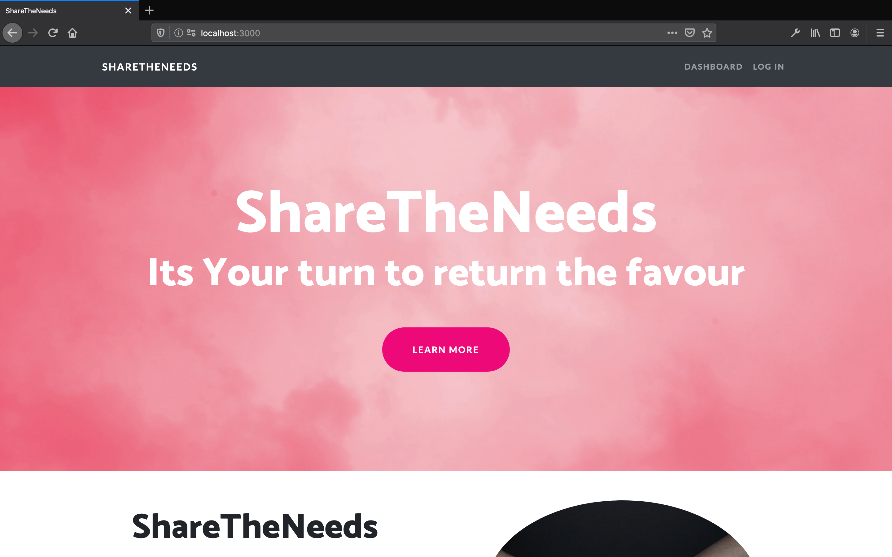
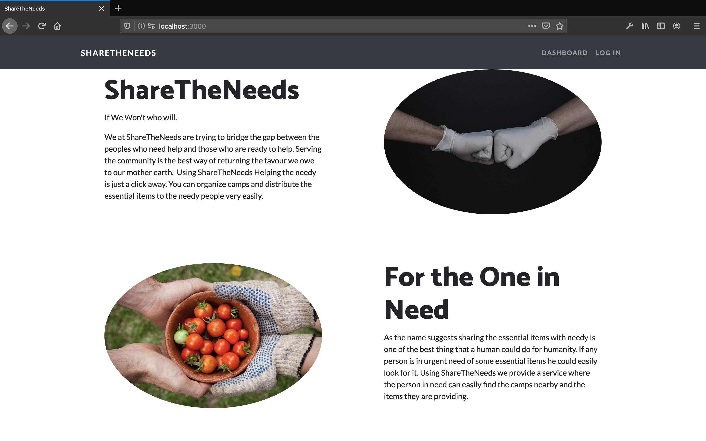
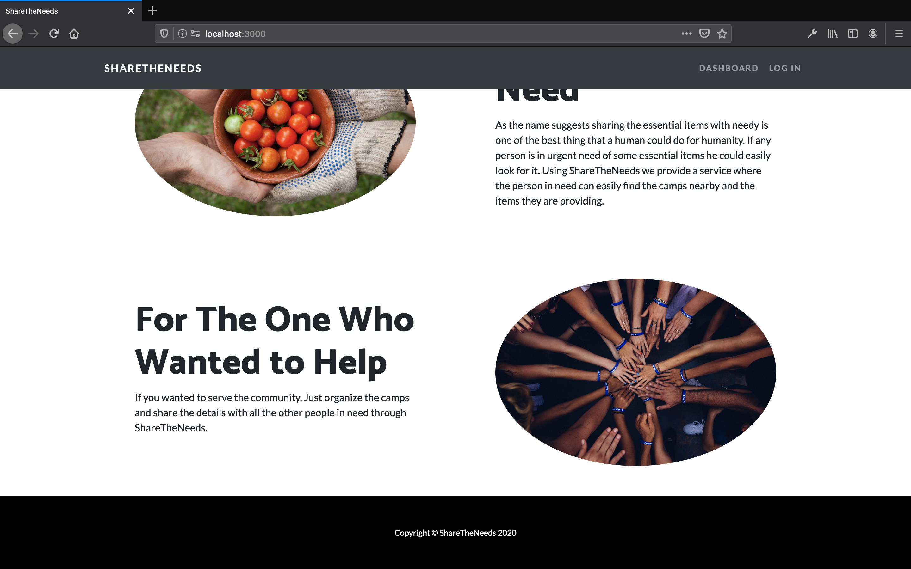

___
___
#### Analysis
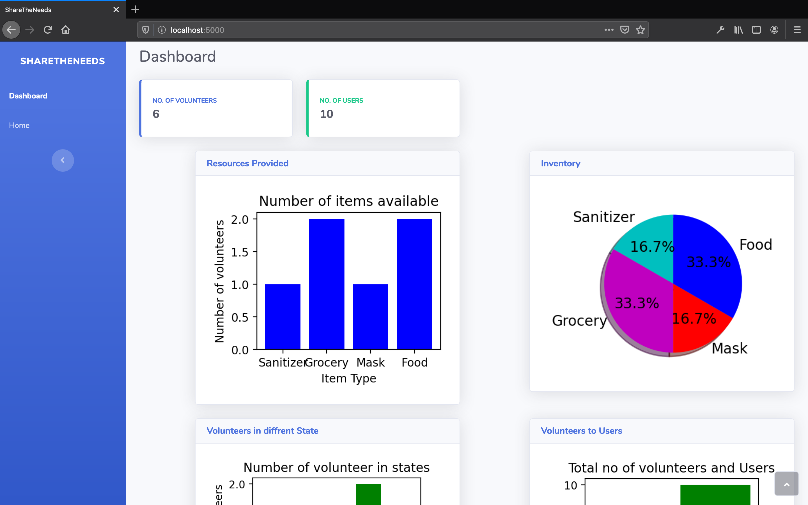
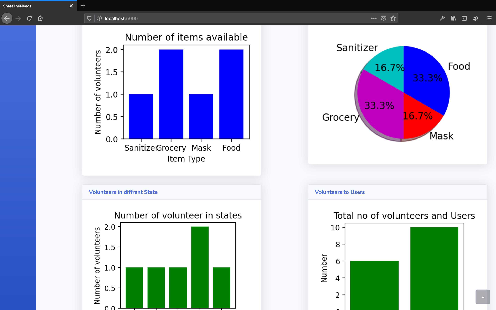

___
___
#### Login/Signup Screen
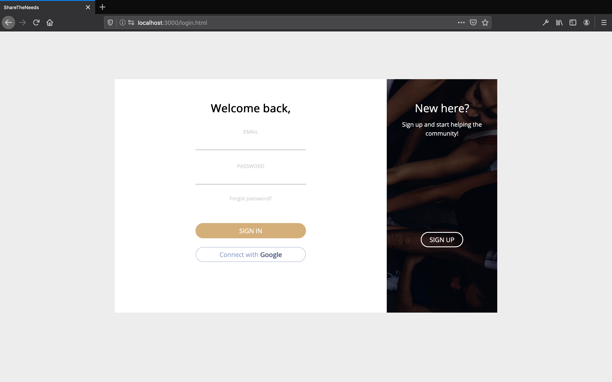
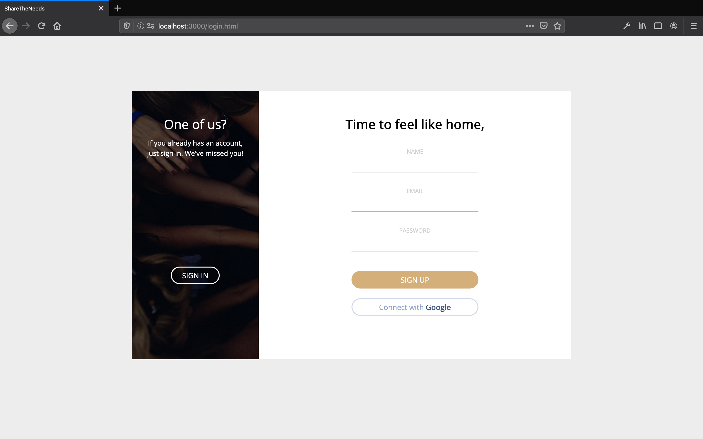

___
___
#### Map
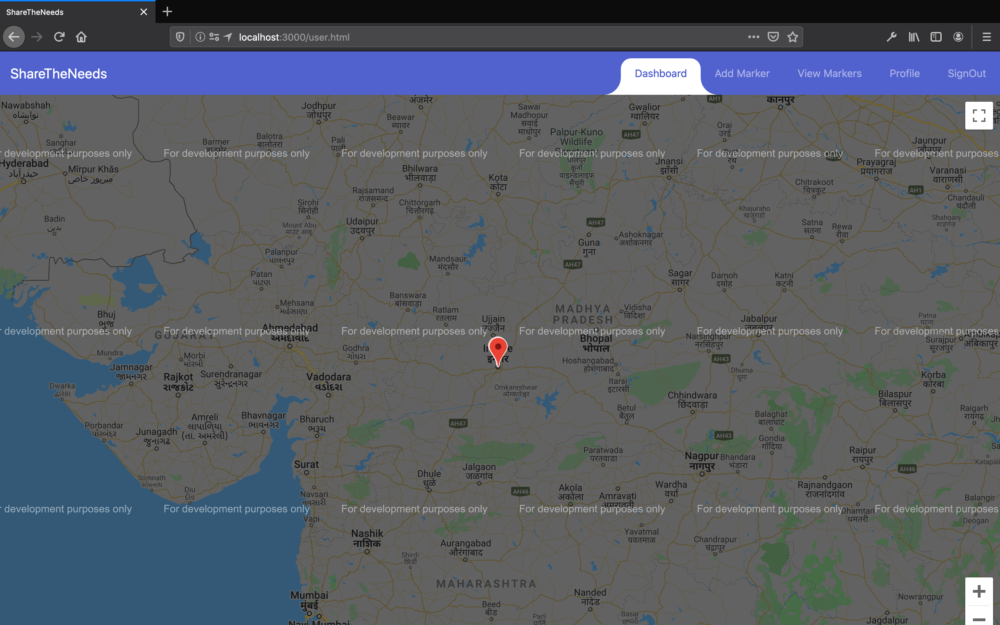
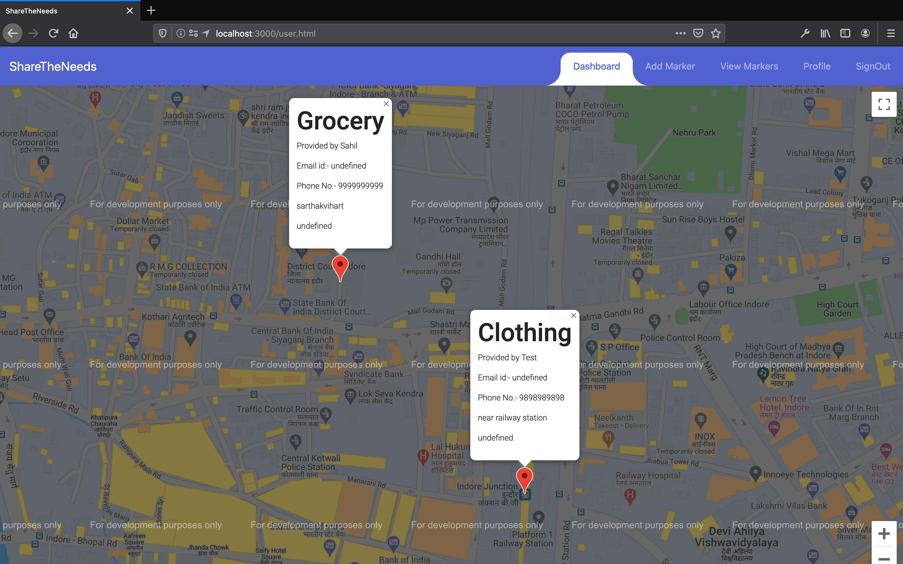

___
___
#### Adding Marker 
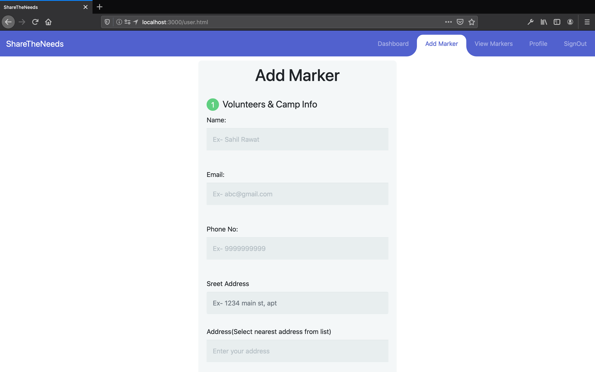

___
___
#### View Marker
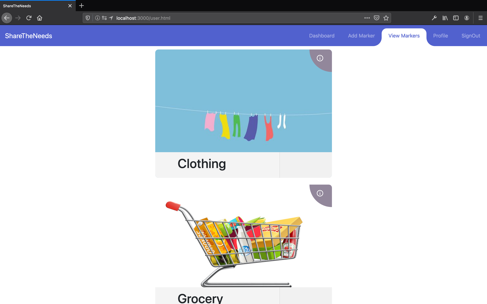
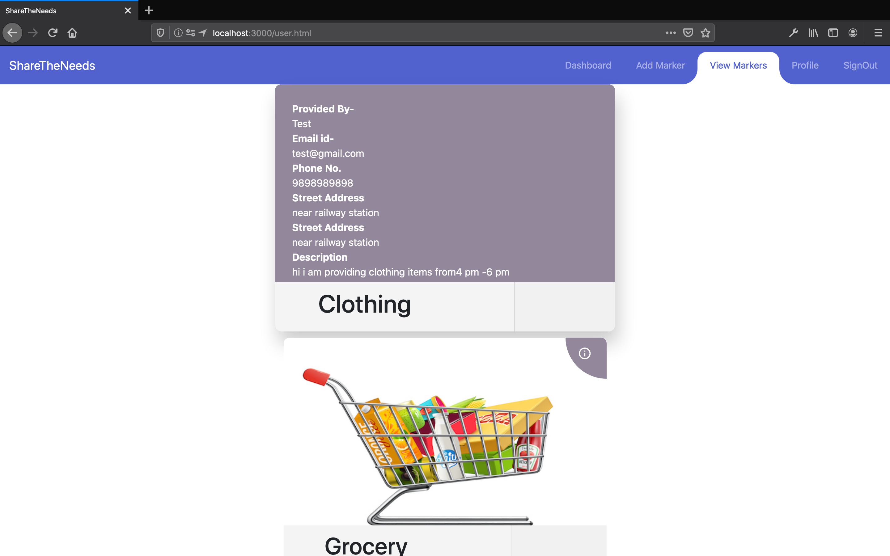

___
___
#### Profile
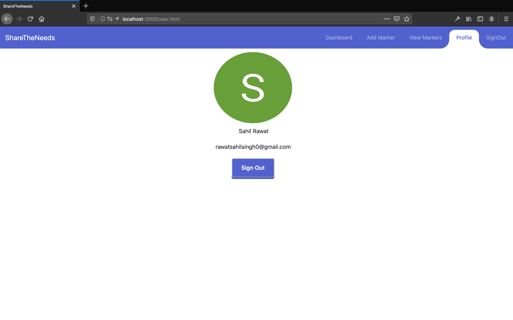

___
## *Technologies :*

We have used different technologies in our app and website which are as follows :
#### Andriod App :
- Flutter - For Creating cross platform app
- FireBaseAuth - For Authenticating Users 
- FireBase Firestore - For Storing Data related to the camps that the Volunteers are going to organize

#### Website(Marker Adding) :
- Html , CSS - For Creating Basic structure of Our website
- BootStrap - For creating impressive UI for our FrontEnd
- Node JS - For handling Backend
- FireBaseAuth - For Authenticating Users
- FireBase Firestore - For Storing Data related to the camps that the Volunteers are going to organize
- Google Maps Javascript API - For displaying the maps and (markers & infoWindow on those maps)
- Google Places Search API - To Create an autocomplete searchbox field in order to prevent user from entering invalid address and identify the address and extract latitude and longitude values from those Places in order to add markers on map

#### Website(Analysis) :
- Html , CSS - For Creating Basic structure of Our website
- BootStrap - For creating impressive UI for our FrontEnd
- Flask - microweb framework for websites
- Firebase Realtime Databse - Used to extract Data from the firebase cloud databse and then working on that data in python 
- Python - For analysing the data extracted from firebase and plotting graphs and pie chart using matplotlib library

___
## *Installation :*
Instructions For Using
#### Andriod App : 
- Requirements - Flutter SDK, Android Studio (or any IDE you preffer for devloping flutter Apps)
- Import the App Folder in Android Studio or your prefferable IDE 
- Build APK from the Flutter Project or 
- Get the APK from: https://drive.google.com/file/d/1ef-WEqnGATrHg7yruLcsmDAZ5B9aoRz9/view?usp=sharing

#### Website(Marker Adding) :
- Clone the Repo locally
- Open the Website Folder
- Install NodeJs on your computer
- Open Terminal and enter `npm start`
- Open The Browser and goto `127.0.0.1:3000` or `localhost:3000` (if the port is busy look in terminal the port no. and enter that replacing 3000) or
- Visit : https://sharetheneeds.herokuapp.com

#### Website(Analysis) :
- Clone the repo locally
- Open the analyze folder
- Install the required dependencies using `pip install -r requirements.txt` (All the required Dependencies will automatically installed)
- Run the command in terminal `python3 firstflask.py`

___

## *Support :*
- Contact us at : sharetheneeds@gmail.com
- Website : https://sharetheneeds.herokuapp.com
___

## *Author and Acknowledment :*

> ### Ankit Gupta
- Email: ankit.gupta18@st.niituniversity.in
- Contribution: Flutter Application

___
> ### Siddhant Sharma
- Email: siddhant.sharma18a@niituniversity.in
- Contribution: Flutter Application

___
> ### Nikhil Khandelwal
- Email: nikhil.khandelwal18@niituniversity.in
- Contribution: Data Analysis in python and flask

___
> ### Ish Choudhary
- Email: ish.choudhary18@niituniversity.in
- Contribution: Data Analysis in python and flask

___
> ### Sahil Singh Rawat
- Email: sahil.rawat18@niituniversity.in
- Contribution: Website (Frontend in Bootstrap + Backend in Nodejs)

